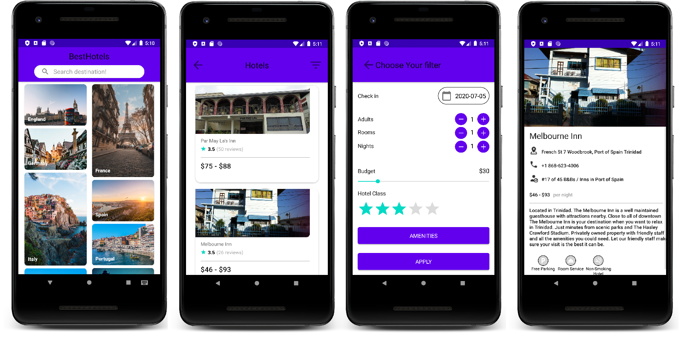

# BestHotels

## Description
Purpose of this application is to find hotels all around the world. It's has been built with **latest-trending tools.**

## Download
- Download APK from [here](https://drive.google.com/file/d/1UoqekdPPZDa4DXuf-KNF02wzoAROH6b3/view?usp=sharing)

## Technologies 🛠
- **Kotlin**
- **Coroutines** - for asynchronous operations
- **Flow** - for streaming
- **Architecture components**
  - **LiveData** - notifies UI when any changes happened
  - **ViewModel** - restores state
  - **Navigation** - provides single Activity architecture
  - **Room** - serves as single source of truth
- **Dagger 2** - dependency injection
- **Retrofit** - remote operations
- **Glide** - image loading

## How to use the application
- Clone this repository
- Replace the following values in the `NetworkModule.kt` file:
  - **header("x-rapidapi-host","THIS SHOULD BE REPLACED"")**
  - **header("x-rapidapi-key", "THIS SHOULD BE REPLACED")**

You can get your own api-key [here](https://rapidapi.com/apidojo/api/tripadvisor1).
